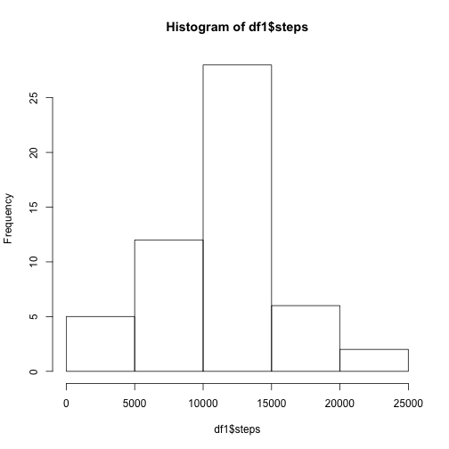
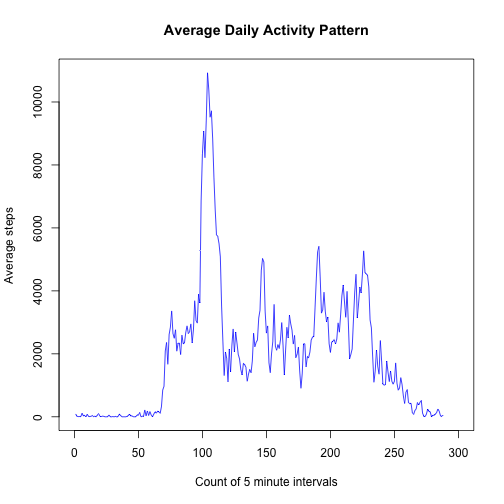
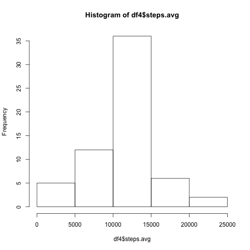
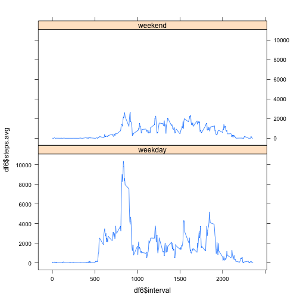

  
### Synopsis
This analysis uses data from a personal activity monitoring device such as a Nike fit band.  The dataset includes the number of steps sampled at 5 minute intervals, through out each day, over the course of two months in October and Novemeber, 2012. The exploratory analysis below shows on average what the daily activity pattern was, and how activity levels compare between weekends and weekdays. 
 
  
### Data Processing

1 -- Load the packages required for data processing and set options.


```r
library(reshape2)
library(dplyr)
options(digits=12)
```

2 -- Read in the dataset we will perform the analysis on.


```r
raw <- read.csv("activity.csv")
```

3 -- Create a data frame (df1) grouped by date and total steps for each day.


```r
options(digits=12)
df1 <- raw %>%
group_by(date) %>% 
summarise_each(funs(sum(., complete.cases=TRUE)))
df1$date <- as.Date(df1$date, format="%Y-%m-%d")
df1 <- df1[,c(-3)]  # remove the interval column
#str(df1)
```


4 -- Create a data frame (df2) grouped by interval and total steps for each day.


```r
df2 <- raw  
df2 <- df2[,-2] %>%   # remove date column to avoid issue with factor
group_by(interval) %>%
summarise_each(funs(sum(., na.rm=TRUE)))
#str(df2)
```
5 -- Create a wide format data frame (wdf) that imputes the missing values, by using the mean total steps for each interval.


```r
wdf_raw <- reshape(raw, direction = "wide", idvar="interval", timevar ="date")
wdf <- wdf_raw[,-1]             # remove interval column 
interval <- wdf_raw[,1]         # interval column to vector
for(i in 1:nrow(wdf)){          # for every row
x <- as.numeric(wdf[i,])        # subset/extract that row
y <- is.na(x)                   # count NAs
z <- !is.na(x)                  # count non-NAs
result <- mean(x[z])            # pass numeric vector to mean() function
wdf[i,y] <- result}             # replace NA values in that row with the row mean}    
wdf <- cbind(interval, wdf)     # melt data and intervals back together
#str(wdf)
```
  
6 -- Melt the wide format data frame (wdf) with the newly imputed values to a tall format data frame (df3).

```r
df3 <- melt(wdf, id="interval")
colnames <- c("interval", "date", "steps.avg")
names(df3) <- colnames
#str(df3)
```


### Results

1 -- Here we report the average number of steps taken per day, the interval that had the average maximum steps, the mean and median total number of steps taken per day.


```r
steps.max <- max(df2$steps)       # get max average steps
int <- (df2$steps == steps.max)   # conditional vector T/F 
int <- df2$interval[int]          # use cond vector to find which interval had the max steps 
row <- which(df2$steps == steps.max) #print(row)     
max <- as.numeric(df2[(df2$steps == steps.max),2]) 
```


```r
print(int)  # print interval with the most steps on average
```

```
## [1] 835
```


```r
print(max)  # print maximm average steps taken per day
```

```
## [1] 10927
```


```r
steps.mean <- mean(df1$steps, na.rm=TRUE)
print(steps.mean)  # print mean total number of steps per day
```

```
## [1] 10767.1886792
```


```r
steps.median <- median(df1$steps, na.rm=TRUE)
print(steps.median)  # print median total number of steps per day
```

```
## [1] 10766
```


2 -- Here we plot a histogram showing the frequency of the average steps taken each day.

```r
hist(df1$steps)   # plot histogram using data frame df1
```

 

2 -- Here we plot a line chart showing the average steps taken per interval.

```r
      with(df2, plot(1:288,steps, type="l", xlim=c(0, 300),
      col = "blue", 
      main = "Average Daily Activity Pattern",
      ylab = "Average steps",
      xlab = "Count of 5 minute intervals"
))
```

 

3 -- Here we plot a histogram showing the imputed NA values using the observation mean.


```r
df4 <- df3 %>% 
group_by(date) %>%
summarise_each(funs(sum(.)))
hist(df4$steps.avg)
```

 

4 -- Here we show a two panel plot comparing weekday and weekend activity levels using data frame "df3".


```r
df5 <- df3 %>% 
group_by(date,interval) %>%
summarise_each(funs(sum(.)))
date <- gsub("steps.", "", df5$date)
df5 <- df5[,-1]
df5 <- cbind(date, df5)
df5$date <- as.Date(df5$date, format="%Y-%m-%d")  # convert factors to dates
weekdays <- sapply(df5$date, weekdays)  # set days of the week based on date column 
df5 <- cbind(df5,weekdays)
df5$weekdays <- as.character(df5$weekdays)        # convert factor to strings
day.type <- ifelse(df5$weekdays %in% c("Saturday", "Sunday"), "weekend", "weekday")
df5 <- cbind(df5,day.type)
df5 <- df5[,c(-1,-4)]
df6 <- df5 %>% 
group_by(interval,day.type) %>%
summarise_each(funs(sum(.)))
```


```r
library(lattice)
xyplot(df6$steps.avg ~ df6$interval | df6$day.type, layout=c(1,2), type="l")
```

 


